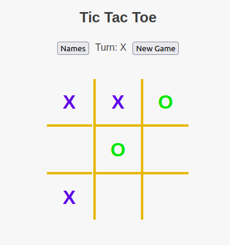

# Tic Tac Toe

A JavaScript project recommended by [The Odin Project](https://www.theodinproject.com/lessons/javascript-tic-tac-toe) curriculum. The main objective was to practice recently acquired knowledge of factory functions and closures with the module pattern.

## Additional Features and Reflections

This was my first time trying to implement the 'click out of modal to close modal' feature. After several hours and attempts to get it just right, I had to settle (for now) on targeting the html for the click event; meaning, there is a small area outside the modal (on the game board and buttons) that will not trigger the click event-- the click must happen further away.

I enjoy this module pattern for organizing js-- it feels more familiar to Ruby's implementation of classes, which I always felt made my code very organized, maintainable, and visually pleasing. I'm curious though to learn how to implement something like a public or class method within a factory function. For example, on my Player function-- I would have liked to place some methods related to Player but not for a particular instance of player. I didn't find a solution while working on this project. Perhaps I'll find one in the future or maybe that is a drawback of choosing factory functions for object creation?